# System Workflow Documentation

This document describes the complete workflows and business processes of the Cangkir Mini Soccer booking system.

## Table of Contents

- [Overview](#overview)
- [User Roles](#user-roles)
- [Customer Journey](#customer-journey)
- [Admin Journey](#admin-journey)
- [Booking Lifecycle](#booking-lifecycle)
- [Payment Flow](#payment-flow)
- [Cancellation Process](#cancellation-process)
- [Multi-Hour Booking](#multi-hour-booking)
- [Time Slot Management](#time-slot-management)
- [Error Scenarios](#error-scenarios)
- [Notification Flow](#notification-flow)

---

## Overview

Cangkir Mini Soccer is a **guest-based booking system** designed for small-scale mini soccer field operations. The system eliminates the need for user registration while providing robust admin management capabilities.

**Key Characteristics:**

- No user registration required
- Manual payment confirmation
- WhatsApp-based communication
- Admin-managed booking lifecycle
- Flexible time slot configuration

---

## User Roles

### 1. Guest (Customer)

**Permissions:**

- View available time slots
- Check real-time availability
- Create bookings
- View own booking details (via booking code)
- Cancel bookings (within policy)

**Limitations:**

- Cannot manage other bookings
- Cannot access admin features
- Cannot modify booking after creation
- Must contact admin for special requests

### 2. Admin

**Permissions:**

- Full booking management (view, update, delete)
- Confirm/cancel bookings
- Update payment status
- Manage time slots (create, update, activate, deactivate)
- View statistics and reports
- Add administrative notes

**Responsibilities:**

- Confirm bookings promptly
- Update payment status after receiving payment
- Handle customer inquiries via WhatsApp
- Manage field availability
- Resolve booking conflicts

---

## Customer Journey

### Step 1: Browse Time Slots

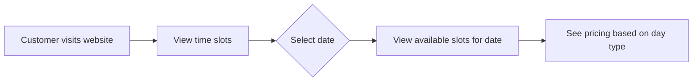
```mermaid
graph LR
A[Customer visits website] --> B[View time slots]
B --> C{Select date}
C --> D[View available slots for date]
D --> E[See pricing based on day type]
```

**API Calls:**

1. `GET /api/time-slots` - Get all active time slots
2. `GET /api/time-slots/by-day-type/WEEKEND` - Filter by day type (optional)
3. `GET /api/bookings/availability?date=2024-12-25` - Check specific date availability

**Customer sees:**

- Time slots grouped by weekday/weekend
- Different pricing for weekday vs weekend
- Real-time availability status

---

### Step 2: Check Availability

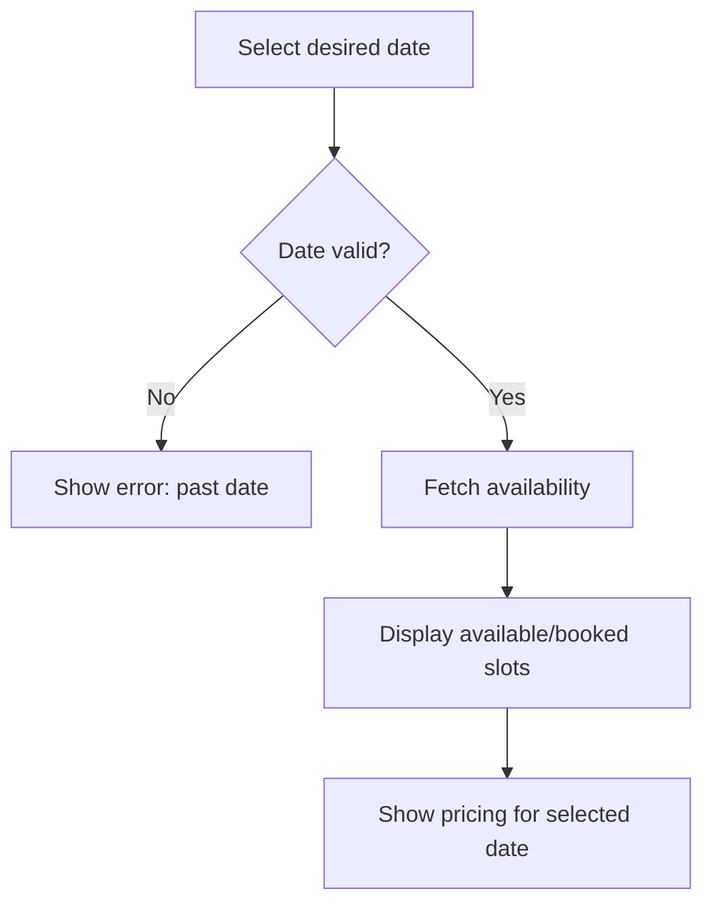
```mermaid
graph TD
A[Select desired date] --> B{Date valid?}
B -->|No| C[Show error: past date]
B -->|Yes| D[Fetch availability]
D --> E[Display available/booked slots]
E --> F[Show pricing for selected date]
```

**Validation:**

- Date cannot be in the past
- Date cannot exceed 30 days advance (configurable)
- Show which slots are already booked

**API Call:**

```
GET /api/bookings/availability?date=2024-12-25
```

**Response indicates:**

- Day type (WEEKDAY or WEEKEND)
- Each slot's availability status
- Pricing for each slot

---

### Step 3: Create Booking

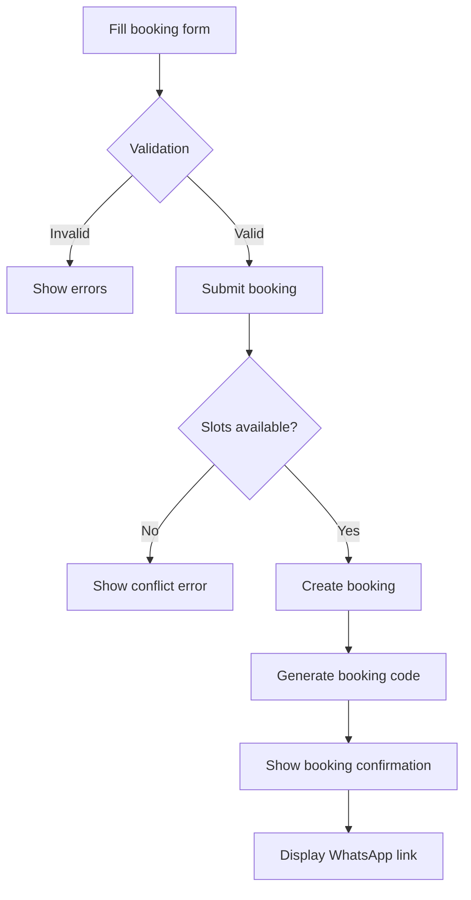
```mermaid
graph TD
A[Fill booking form] --> B{Validation}
B -->|Invalid| C[Show errors]
B -->|Valid| D[Submit booking]
D --> E{Slots available?}
E -->|No| F[Show conflict error]
E -->|Yes| G[Create booking]
G --> H[Generate booking code]
H --> I[Show booking confirmation]
I --> J[Display WhatsApp link]
```

**Required Information:**

- Customer name (3-100 characters)
- Customer phone (Indonesian format: 08xxx or 628xxx)
- Booking date (YYYY-MM-DD format)
- Time slot IDs (1-8 slots)
- Payment method (CASH or TRANSFER)

**API Call:**

```json
POST /api/bookings
{
  "customerName": "John Doe",
  "customerPhone": "628123456789",
  "bookingDate": "2024-12-25",
  "timeSlotIds": [1, 2, 3],
  "paymentMethod": "CASH"
}
```

**System Actions:**

1. Validate all inputs
2. Check slot availability (atomic operation)
3. Calculate total price based on day type
4. Generate unique booking code (BKG-YYYYMMDD-XXX)
5. Create booking records (one per slot)
6. Group bookings by bookingCode and bookingGroupId
7. Return booking details + WhatsApp URL

**Business Rules:**

- All selected slots must be available
- Cannot book more than 8 hours
- Cannot book more than 30 days in advance
- All slots must belong to same day type
- Booking code auto-increments daily

---

### Step 4: Contact Admin via WhatsApp

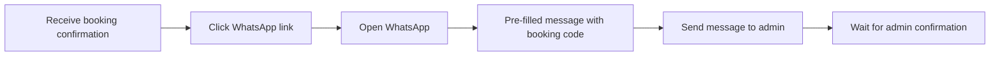
```mermaid
graph LR
A[Receive booking confirmation] --> B[Click WhatsApp link]
B --> C[Open WhatsApp]
C --> D[Pre-filled message with booking code]
D --> E[Send message to admin]
E --> F[Wait for admin confirmation]
```

**WhatsApp URL Format:**

```
https://wa.me/628123456789?text=Hi%20Admin%2C%20I%20want%20to%20confirm%20my%20booking%20BKG-20241225-001
```

**Pre-filled Message:**

```
Hi Admin, I want to confirm my booking BKG-20241225-001

Details:
- Customer: John Doe
- Date: 2024-12-25
- Time: 08:00 - 11:00 (3 hours)
- Total: Rp 900,000
- Payment: CASH
```

**Customer Actions:**

- Send booking details to admin
- Discuss payment method
- Confirm attendance
- Ask questions if needed

---

### Step 5: Make Payment

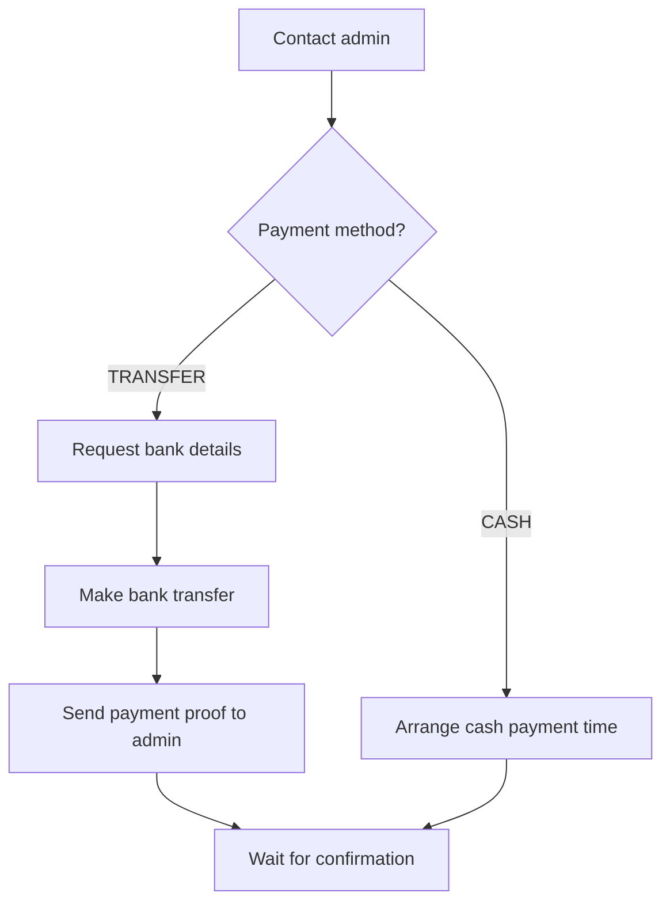
```mermaid
graph TD
A[Contact admin] --> B{Payment method?}
B -->|CASH| C[Arrange cash payment time]
B -->|TRANSFER| D[Request bank details]
D --> E[Make bank transfer]
E --> F[Send payment proof to admin]
F --> G[Wait for confirmation]
C --> G
```

**Payment Methods:**

**CASH:**

1. Customer contacts admin via WhatsApp
2. Admin provides location/meeting point
3. Customer pays cash directly
4. Admin updates payment status immediately

**TRANSFER:**

1. Customer requests bank account details
2. Admin provides account information via WhatsApp
3. Customer makes bank transfer
4. Customer sends payment proof (screenshot)
5. Admin verifies payment
6. Admin updates payment status in system

**No automatic payment gateway** - all confirmations are manual.

---

### Step 6: Receive Confirmation

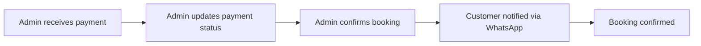
```mermaid
graph LR
A[Admin receives payment] --> B[Admin updates payment status]
B --> C[Admin confirms booking]
C --> D[Customer notified via WhatsApp]
D --> E[Booking confirmed]
```

**Admin updates in system:**

- Payment status: UNPAID → PAID
- Booking status: PENDING → CONFIRMED
- Add admin notes (e.g., "Payment received via transfer")

**Customer receives:**

- WhatsApp confirmation message
- Booking is now confirmed
- Can check status anytime via booking code

---

### Optional: Cancel Booking

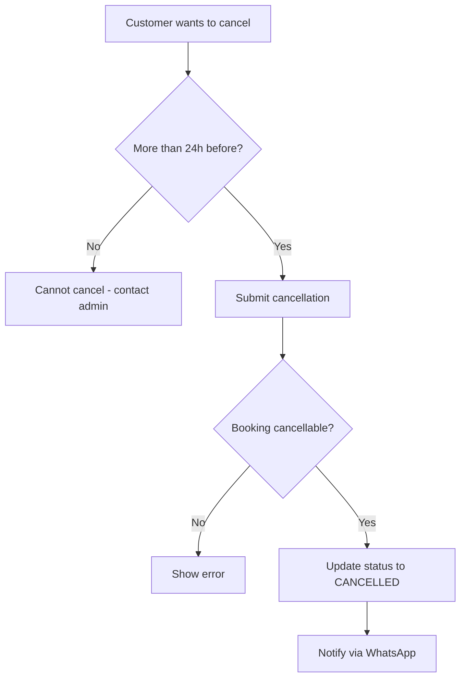
```mermaid
graph TD
A[Customer wants to cancel] --> B{More than 24h before?}
B -->|No| C[Cannot cancel - contact admin]
B -->|Yes| D[Submit cancellation]
D --> E{Booking cancellable?}
E -->|No| F[Show error]
E -->|Yes| G[Update status to CANCELLED]
G --> H[Notify via WhatsApp]
```

**Cancellation Policy:**

- Must cancel at least 24 hours before booking date
- Can only cancel PENDING or CONFIRMED bookings
- Cannot cancel COMPLETED bookings
- Provide optional cancellation reason

**API Call:**

```json
POST /api/bookings/BKG-20241225-001/cancel
{
  "cancellationReason": "Emergency, cannot attend"
}
```

**System Actions:**

1. Validate cancellation timing (24-hour rule)
2. Check booking status
3. Update all related bookings to CANCELLED
4. Record cancellation reason
5. Free up time slots for other customers

**Refund Eligibility:**

- Determined by admin policy
- System indicates if eligible
- Admin handles refund manually

---

## Admin Journey

### Admin Dashboard Access

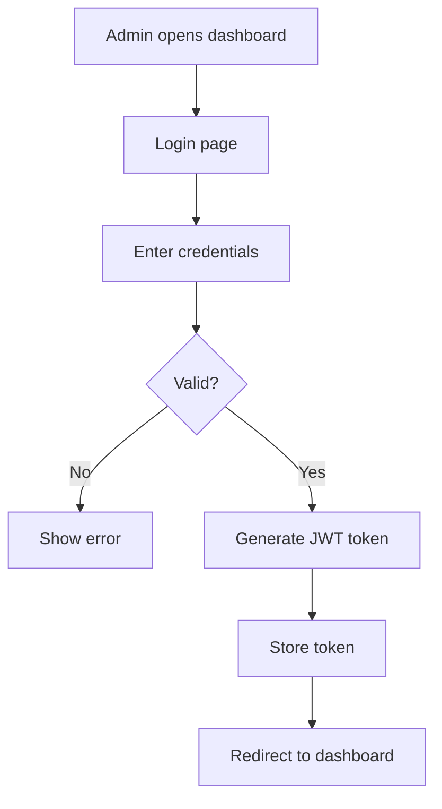
```mermaid
graph TD
A[Admin opens dashboard] --> B[Login page]
B --> C[Enter credentials]
C --> D{Valid?}
D -->|No| E[Show error]
D -->|Yes| F[Generate JWT token]
F --> G[Store token]
G --> H[Redirect to dashboard]
```

**Login Flow:**

1. Navigate to admin login page
2. Enter username and password
3. System validates credentials (bcrypt)
4. Generate JWT token (7-day expiration)
5. Return token to client
6. Client stores token (localStorage/cookie)
7. Include token in all subsequent requests

**API Call:**

```json
POST /api/admin/auth/login
{
  "username": "admin",
  "password": "admin123"
}
```

**Response:**

```json
{
  "accessToken": "eyJhbGciOiJIUzI1NiIsInR5cCI6IkpXVCJ9...",
  "admin": {
    "id": 1,
    "username": "admin"
  },
  "expiresIn": "7d"
}
```

---

### View Dashboard Statistics

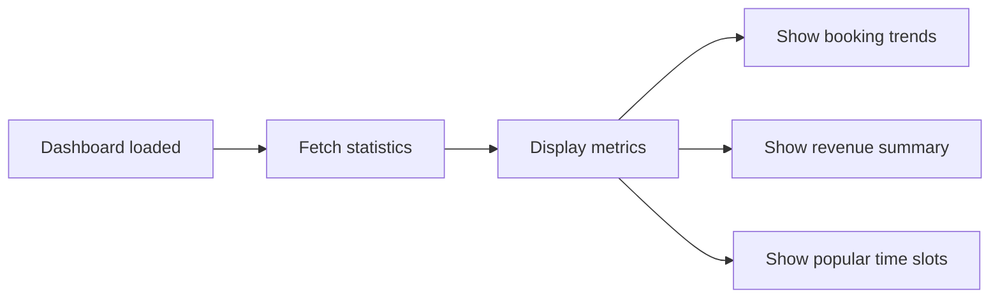
```mermaid
graph LR
A[Dashboard loaded] --> B[Fetch statistics]
B --> C[Display metrics]
C --> D[Show booking trends]
C --> E[Show revenue summary]
C --> F[Show popular time slots]
```

**Dashboard Metrics:**

**Booking Statistics:**

- Total bookings (all time or date range)
- Bookings by status (PENDING, CONFIRMED, COMPLETED, CANCELLED)
- Recent bookings list

**Revenue Metrics:**

- Total revenue
- Paid vs Unpaid amounts
- Revenue by payment method (CASH vs TRANSFER)
- Average booking value

**Popular Insights:**

- Most booked time slots
- Peak booking days
- Customer trends

**API Call:**

```
GET /api/admin/bookings/statistics?startDate=2024-01-01&endDate=2024-12-31
```

**Refresh frequency:**

- Auto-refresh every 5 minutes (recommended)
- Manual refresh button available

---

### Manage Bookings

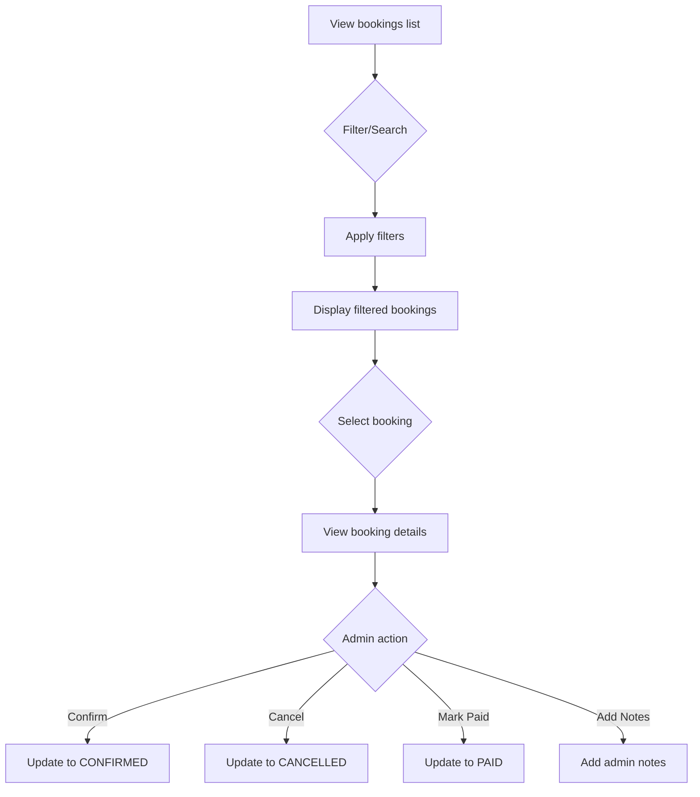
```mermaid
graph TD
A[View bookings list] --> B{Filter/Search}
B --> C[Apply filters]
C --> D[Display filtered bookings]
D --> E{Select booking}
E --> F[View booking details]
F --> G{Admin action}
G -->|Confirm| H[Update to CONFIRMED]
G -->|Cancel| I[Update to CANCELLED]
G -->|Mark Paid| J[Update to PAID]
G -->|Add Notes| K[Add admin notes]
```

**Booking List Features:**

**Filtering:**

- By booking status (PENDING, CONFIRMED, COMPLETED, CANCELLED)
- By payment status (PAID, UNPAID)
- By payment method (CASH, TRANSFER)
- By date range (startDate to endDate)
- By search term (customer name, phone, booking code)

**Sorting:**

- By booking date (newest/oldest)
- By creation date
- By total price

**Pagination:**

- Configurable page size (default: 10, max: 100)
- Page navigation

**API Call:**

```
GET /api/admin/bookings?page=1&limit=10&bookingStatus=PENDING&sortBy=bookingDate&sortOrder=desc
```

---

### Confirm Booking

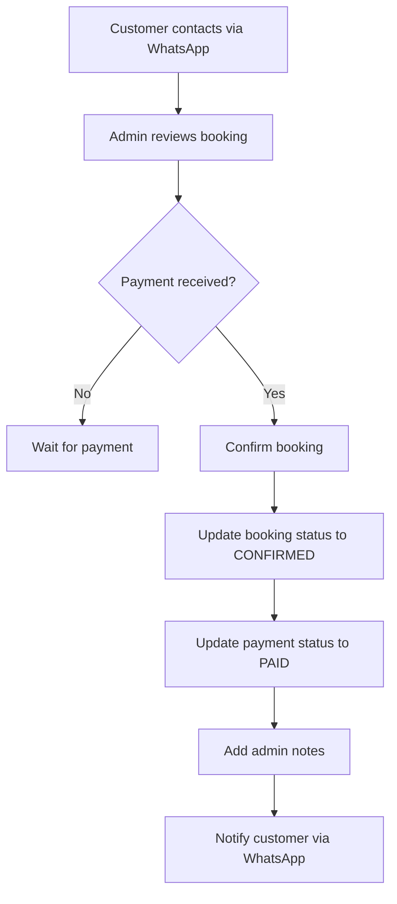
```mermaid
graph TD
A[Customer contacts via WhatsApp] --> B[Admin reviews booking]
B --> C{Payment received?}
C -->|No| D[Wait for payment]
C -->|Yes| E[Confirm booking]
E --> F[Update booking status to CONFIRMED]
F --> G[Update payment status to PAID]
G --> H[Add admin notes]
H --> I[Notify customer via WhatsApp]
```

**Confirmation Process:**

1. **Receive WhatsApp message** from customer
2. **Verify booking** exists in system
3. **Check payment status** (cash received or transfer verified)
4. **Update booking status:**
   ```json
   PATCH /api/admin/bookings/1/status
   {
     "bookingStatus": "CONFIRMED",
     "adminNotes": "Payment received via cash"
   }
   ```
5. **Update payment status:**
   ```json
   PATCH /api/admin/bookings/1/payment
   {
     "paymentStatus": "PAID",
     "paymentMethod": "CASH"
   }
   ```
6. **Send confirmation** to customer via WhatsApp

**Admin Notes Examples:**

- "Payment confirmed via bank transfer - BCA"
- "Customer paid cash in full"
- "Deposit received, balance on arrival"
- "Regular customer - payment verified"

---

### Handle Cancellations

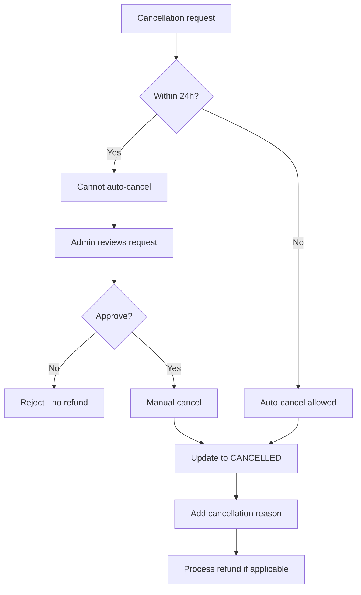
```mermaid
graph TD
A[Cancellation request] --> B{Within 24h?}
B -->|Yes| C[Cannot auto-cancel]
C --> D[Admin reviews request]
D --> E{Approve?}
E -->|No| F[Reject - no refund]
E -->|Yes| G[Manual cancel]
B -->|No| H[Auto-cancel allowed]
H --> I[Update to CANCELLED]
G --> I
I --> J[Add cancellation reason]
J --> K[Process refund if applicable]
```

**Cancellation Scenarios:**

**1. Customer Self-Cancel (>24h before):**

- Customer cancels via API
- Automatic approval
- System updates status
- Admin notified

**2. Customer Requests Cancel (<24h before):**

- Customer contacts admin
- Admin evaluates situation
- Manual cancellation in system
- Refund decision by admin

**3. Admin-Initiated Cancel:**

- Field maintenance/emergency
- Weather conditions
- Customer no-show
- Admin cancels and notifies customer

**API Call:**

```json
PATCH /api/admin/bookings/1/status
{
  "bookingStatus": "CANCELLED",
  "adminNotes": "Customer emergency - approved refund"
}
```

---

### Manage Time Slots

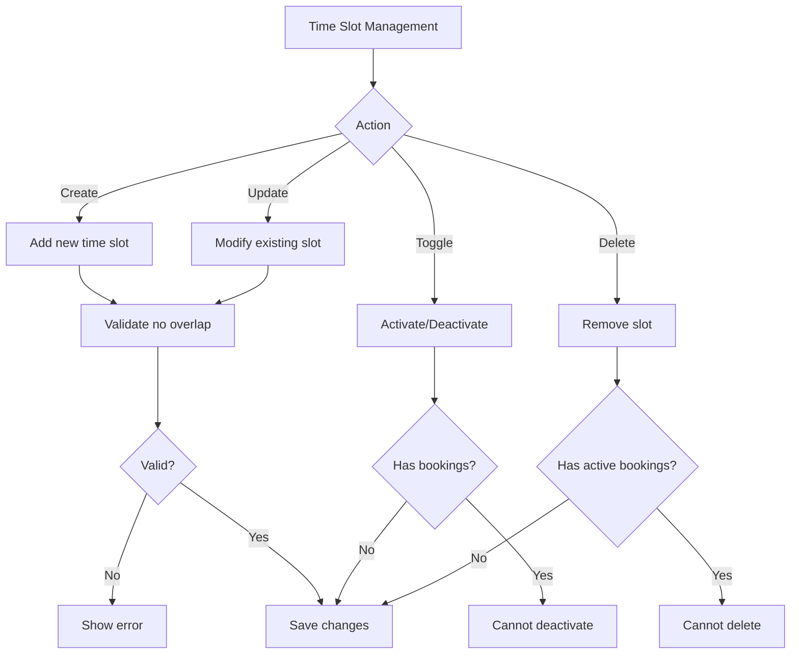
```mermaid
graph TD
A[Time Slot Management] --> B{Action}
B -->|Create| C[Add new time slot]
B -->|Update| D[Modify existing slot]
B -->|Toggle| E[Activate/Deactivate]
B -->|Delete| F[Remove slot]
C --> G[Validate no overlap]
D --> G
G --> H{Valid?}
H -->|No| I[Show error]
H -->|Yes| J[Save changes]
E --> K{Has bookings?}
K -->|Yes| L[Cannot deactivate]
K -->|No| J
F --> M{Has active bookings?}
M -->|Yes| N[Cannot delete]
M -->|No| J
```

**Time Slot Operations:**

**Create New Slot:**

```json
POST /api/admin/time-slots
{
  "startTime": "08:00",
  "endTime": "09:00",
  "dayType": "WEEKDAY",
  "price": 200000
}
```

**Validation:**

- No overlap with existing slots for same day type
- End time after start time
- Valid time format (HH:mm)
- Price must be positive

**Update Slot:**

```json
PUT /api/admin/time-slots/1
{
  "startTime": "08:00",
  "endTime": "09:00",
  "dayType": "WEEKDAY",
  "price": 250000
}
```

**Restrictions:**

- Cannot change time if active future bookings exist
- Price changes only affect new bookings
- Must not create overlap

**Deactivate Slot:**

```json
PATCH /api/admin/time-slots/1/toggle-active
```

**Effects:**

- Slot hidden from public API
- Existing bookings unaffected
- Can be reactivated later

**Delete Slot:**

```json
DELETE /api/admin/time-slots/1
```

**Requirements:**

- No active bookings for this slot
- Permanent deletion (cannot undo)
- Consider deactivating instead

---

## Booking Lifecycle

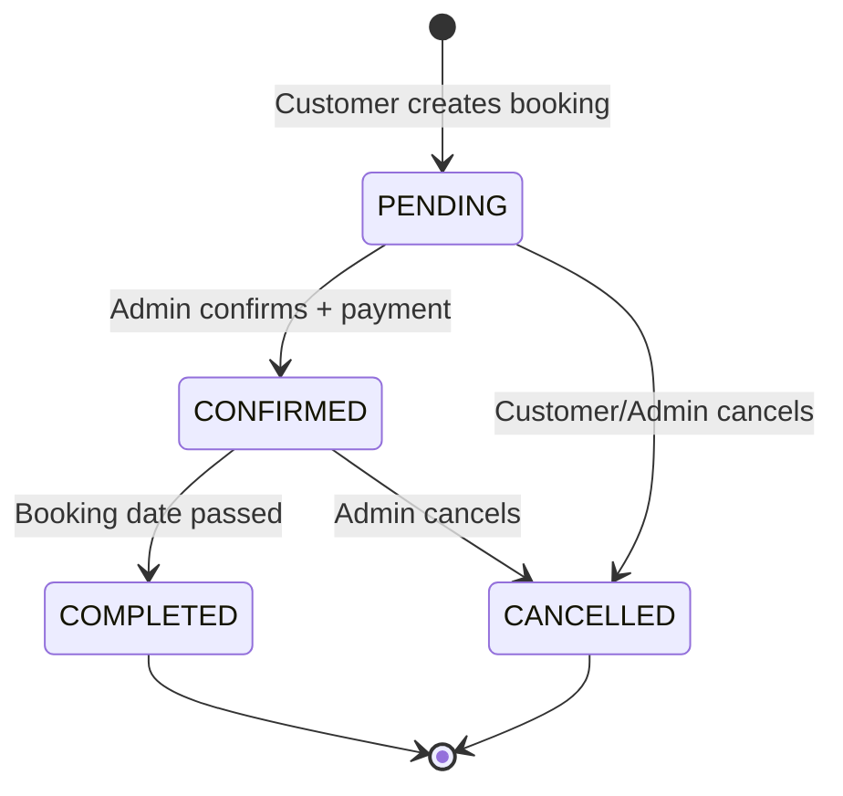
```mermaid
stateDiagram-v2
    [*] --> PENDING: Customer creates booking
    PENDING --> CONFIRMED: Admin confirms + payment
    PENDING --> CANCELLED: Customer/Admin cancels
    CONFIRMED --> COMPLETED: Booking date passed
    CONFIRMED --> CANCELLED: Admin cancels
    COMPLETED --> [*]
    CANCELLED --> [*]
```

### Status Definitions

**PENDING**

- Initial state after booking creation
- Customer has submitted booking
- Awaiting payment confirmation
- Can be cancelled by customer (if >24h before)

**CONFIRMED**

- Admin has confirmed the booking
- Payment received and verified
- Field reserved for customer
- Can only be cancelled by admin or customer (with policy)

**COMPLETED**

- Booking date has passed
- Customer attended (or no-show)
- Final state for successful bookings
- Cannot be modified

**CANCELLED**

- Booking cancelled by customer or admin
- Time slots freed for other bookings
- Refund processed if applicable
- Final state (cannot revert)

---

## Payment Flow

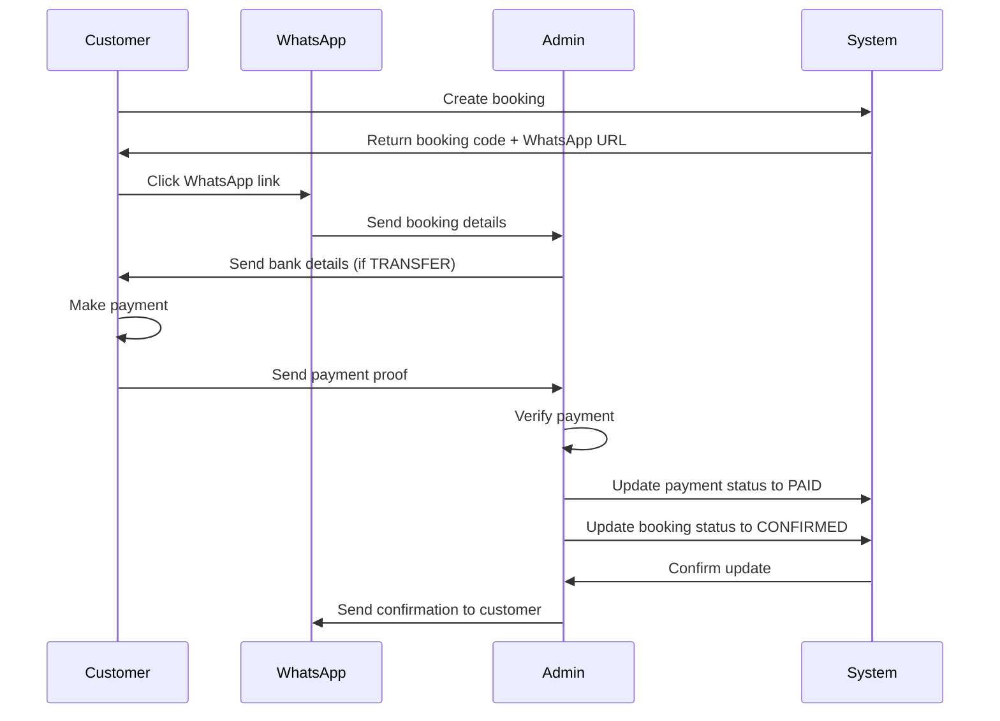
```mermaid
sequenceDiagram
    participant C as Customer
    participant W as WhatsApp
    participant A as Admin
    participant S as System

    C->>S: Create booking
    S->>C: Return booking code + WhatsApp URL
    C->>W: Click WhatsApp link
    W->>A: Send booking details
    A->>C: Send bank details (if TRANSFER)
    C->>C: Make payment
    C->>A: Send payment proof
    A->>A: Verify payment
    A->>S: Update payment status to PAID
    A->>S: Update booking status to CONFIRMED
    S->>A: Confirm update
    A->>W: Send confirmation to customer
```

### Payment Status Flow

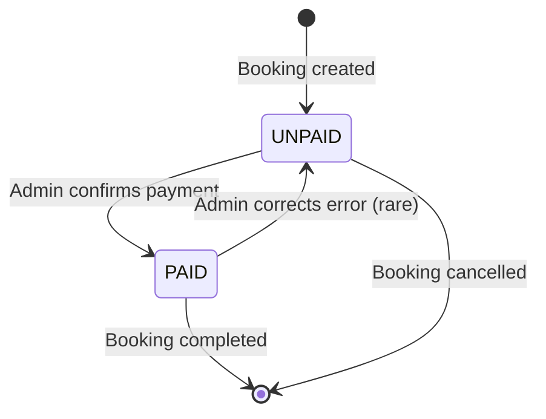
```mermaid
stateDiagram-v2
    [*] --> UNPAID: Booking created
    UNPAID --> PAID: Admin confirms payment
    PAID --> UNPAID: Admin corrects error (rare)
    PAID --> [*]: Booking completed
    UNPAID --> [*]: Booking cancelled
```

**UNPAID:**

- Default state on booking creation
- Customer has not paid yet
- Booking is PENDING
- Admin should follow up

**PAID:**

- Admin confirmed payment received
- Cash collected or transfer verified
- Booking should be CONFIRMED
- Cannot be easily reverted

---

## Cancellation Process

### Customer-Initiated Cancellation

**Timeline-Based Rules:**

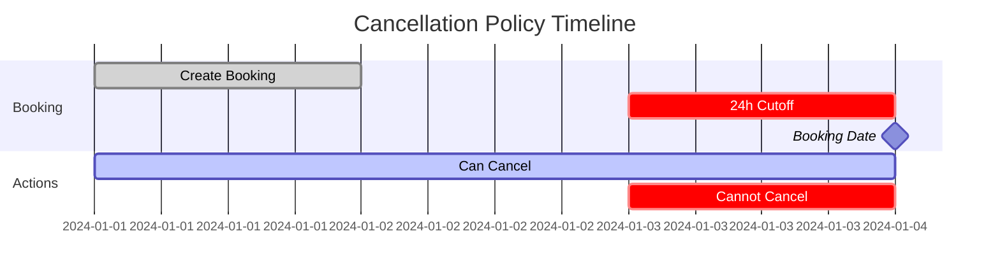
```mermaid
gantt
    title Cancellation Policy Timeline
    dateFormat YYYY-MM-DD
    section Booking
    Create Booking       :done, 2024-01-01, 1d
    24h Cutoff          :crit, 2024-01-03, 1d
    Booking Date        :milestone, 2024-01-04, 0d

    section Actions
    Can Cancel          :active, 2024-01-01, 3d
    Cannot Cancel       :crit, 2024-01-03, 1d
```

**More than 24 hours before booking:**

- Customer can cancel via API
- Automatic approval
- Full refund eligible (admin decides)
- Immediate slot availability

**Less than 24 hours before booking:**

- Cannot cancel via API
- Must contact admin
- Admin discretion required
- Refund unlikely

**API Validation:**

```typescript
const bookingDate = new Date(booking.bookingDate);
const now = new Date();
const hoursDifference = (bookingDate - now) / (1000 * 60 * 60);

if (hoursDifference < 24) {
  throw new Error('Cannot cancel less than 24 hours before booking');
}
```

---

### Admin-Initiated Cancellation

**Scenarios:**

**1. Field Maintenance:**

- Admin cancels booking
- Notifies customer immediately
- Offers reschedule or full refund
- Updates system with reason

**2. Customer No-Show:**

- Booking time passed, customer didn't show
- Admin marks as CANCELLED or COMPLETED (with notes)
- No refund issued
- Field freed for walk-ins

**3. Customer Request (<24h):**

- Customer contacts admin
- Admin evaluates situation
- Manual cancellation decision
- Refund decision case-by-case

**4. Force Majeure:**

- Weather conditions
- Emergency situation
- Government regulation
- Full refund issued

---

## Multi-Hour Booking

### How It Works

When a customer books multiple consecutive hours (e.g., 08:00-11:00):

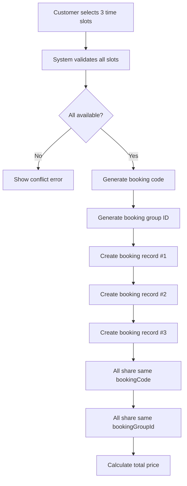
```mermaid
graph TD
A[Customer selects 3 time slots] --> B[System validates all slots]
B --> C{All available?}
C -->|No| D[Show conflict error]
C -->|Yes| E[Generate booking code]
E --> F[Generate booking group ID]
F --> G[Create booking record #1]
G --> H[Create booking record #2]
H --> I[Create booking record #3]
I --> J[All share same bookingCode]
J --> K[All share same bookingGroupId]
K --> L[Calculate total price]
```

**Database Structure:**

```sql
-- Example: 3-hour booking
Booking #1:
  id: 1
  bookingCode: "BKG-20241225-001"
  bookingGroupId: "uuid-1234"
  timeSlotId: 1 (08:00-09:00)
  price: 300000

Booking #2:
  id: 2
  bookingCode: "BKG-20241225-001"
  bookingGroupId: "uuid-1234"
  timeSlotId: 2 (09:00-10:00)
  price: 300000

Booking #3:
  id: 3
  bookingCode: "BKG-20241225-001"
  bookingGroupId: "uuid-1234"
  timeSlotId: 3 (10:00-11:00)
  price: 300000
```

**Benefits:**

- Individual slot tracking
- Flexible partial cancellations (future feature)
- Accurate availability checking
- Detailed reporting per hour

**Atomic Operations:**

- All bookings created in single transaction
- Either all succeed or all fail
- Prevents partial bookings
- Ensures data consistency

**Admin View:**

- Sees all related bookings grouped
- Can update all at once (same bookingCode)
- Total price calculated across all slots
- Hour count displayed clearly

---

## Time Slot Management

### Day Type Detection

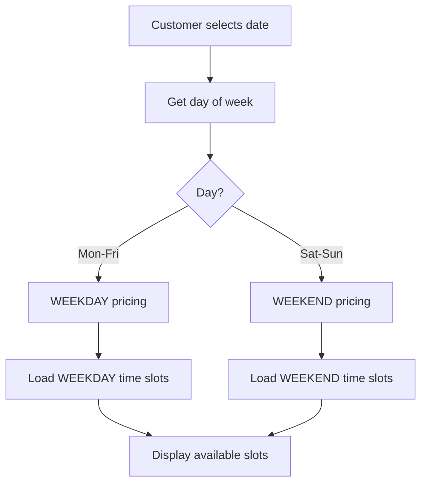
```mermaid
graph TD
A[Customer selects date] --> B[Get day of week]
B --> C{Day?}
C -->|Mon-Fri| D[WEEKDAY pricing]
C -->|Sat-Sun| E[WEEKEND pricing]
D --> F[Load WEEKDAY time slots]
E --> G[Load WEEKEND time slots]
F --> H[Display available slots]
G --> H
```

**Automatic Detection:**

- System determines if date is weekday or weekend
- Loads corresponding time slots
- Shows appropriate pricing
- No manual selection needed

**Pricing Example:**

- Monday 08:00-09:00: Rp 200,000 (WEEKDAY)
- Saturday 08:00-09:00: Rp 300,000 (WEEKEND)
- Same time slot, different day type = different price

---

### Overlap Prevention

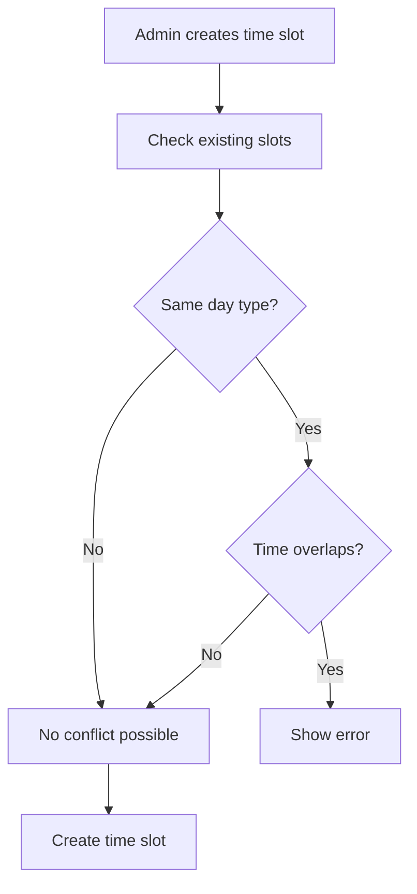
```mermaid
graph TD
A[Admin creates time slot] --> B[Check existing slots]
B --> C{Same day type?}
C -->|No| D[No conflict possible]
C -->|Yes| E{Time overlaps?}
E -->|No| D
E -->|Yes| F[Show error]
D --> G[Create time slot]
```

**Overlap Examples:**

**Conflict:**

- Existing: WEEKDAY 08:00-09:00
- New: WEEKDAY 08:30-09:30
- Result: ❌ REJECTED (overlaps 08:30-09:00)

**No Conflict:**

- Existing: WEEKDAY 08:00-09:00
- New: WEEKEND 08:00-09:00
- Result: ✅ ALLOWED (different day types)

**No Conflict:**

- Existing: WEEKDAY 08:00-09:00
- New: WEEKDAY 09:00-10:00
- Result: ✅ ALLOWED (no overlap)

---

## Error Scenarios

### Booking Conflicts

**Scenario 1: Slot Already Booked**

```
Customer A: Books 08:00-09:00 for Dec 25
Customer B: Tries to book 08:00-09:00 for Dec 25
Result: Customer B gets 409 Conflict error
```

**Handling:**

- Show real-time availability before booking
- Use optimistic locking in database
- Show friendly error message
- Suggest alternative time slots

---

**Scenario 2: Booking in the Past**

```
Today: Dec 24, 2024
Customer tries: Book Dec 23, 2024
Result: 400 Bad Request - date in past
```

**Handling:**

- Validate date client-side first
- Server validates again
- Show clear error message
- Default to today's date

---

**Scenario 3: Exceeds Maximum Advance Days**

```
Max advance: 30 days
Today: Jan 1, 2024
Customer tries: Book Mar 1, 2024 (60 days ahead)
Result: 400 Bad Request - exceeds limit
```

**Handling:**

- Show maximum allowed date
- Disable dates in date picker
- Explain policy to customer

---

**Scenario 4: Exceeds Maximum Hours**

```
Max booking: 8 hours
Customer selects: 10 time slots
Result: 400 Bad Request - too many hours
```

**Handling:**

- Limit selection in UI
- Show remaining hours counter
- Explain maximum booking policy

---

### Payment Issues

**Scenario: Transfer Not Received**

```
1. Customer claims to have transferred
2. Admin checks bank account
3. Transfer not found
4. Admin asks for payment proof
5. Customer provides screenshot
6. Admin verifies details
7. If valid: update payment status
8. If invalid: explain discrepancy
```

---

### Cancellation Issues

**Scenario: Late Cancellation**

```
Booking: Dec 25, 08:00
Current time: Dec 24, 20:00 (4 hours before)
Customer tries: Cancel booking
Result: 400 Bad Request - less than 24h
Action: Customer must contact admin
```

---

## Notification Flow

### WhatsApp Integration

```mermaid
sequenceDiagram
    participant F as Frontend
    participant B as Backend
    participant W as WhatsApp

    F->>B: Create booking
    B->>B: Generate booking code
    B->>F: Return booking details + WhatsApp URL
    F->>F: Display booking confirmation
    F->>W: User clicks WhatsApp link
    W->>W: Open WhatsApp with pre-filled message
    Note over W: User manually sends message
    W->>Admin: Message delivered
```

**No Automated Notifications:**

- System does NOT send automatic WhatsApp messages
- Frontend generates WhatsApp web link
- Customer manually initiates conversation
- All communication happens in WhatsApp app
- No WhatsApp API costs incurred

**Benefits:**

- Zero WhatsApp API costs
- Personal communication touch
- Flexible conversation flow
- Customer controls messaging

**Limitations:**

- Not automated
- Requires manual admin response
- Customer must initiate contact
- No message templates

---

## Best Practices

### For Customers

1. **Check availability first** before filling booking form
2. **Save your booking code** - you'll need it to check status
3. **Contact admin immediately** after booking via WhatsApp
4. **Provide payment proof** when using bank transfer
5. **Cancel early** if plans change (24-hour policy)
6. **Arrive 10 minutes early** on booking day

---

### For Admins

1. **Respond quickly** to WhatsApp messages (within 1 hour)
2. **Verify payments** before confirming bookings
3. **Update system immediately** after receiving payment
4. **Add detailed notes** for every transaction
5. **Review pending bookings** daily
6. **Proactive communication** for any issues
7. **Keep time slots updated** based on field availability
8. **Monitor statistics** to identify trends
9. **Handle cancellations fairly** and promptly
10. **Document special cases** in admin notes

---

## Workflow Metrics

### Expected Response Times

| Action                         | Expected Time                  | Owner        |
| ------------------------------ | ------------------------------ | ------------ |
| Customer creates booking       | Instant                        | System       |
| Admin views WhatsApp message   | < 30 minutes                   | Admin        |
| Admin confirms payment         | < 1 hour after payment         | Admin        |
| Customer receives confirmation | < 5 minutes after admin action | Admin        |
| Cancellation processing        | < 15 minutes                   | System/Admin |

---

### Key Performance Indicators (KPIs)

**Booking Metrics:**

- Booking conversion rate (views → bookings)
- Average response time to WhatsApp
- Confirmation rate (pending → confirmed)
- Cancellation rate by status
- No-show rate

**Revenue Metrics:**

- Average booking value
- Revenue by payment method
- Daily/weekly/monthly revenue
- Payment confirmation time

**Operational Metrics:**

- Most popular time slots
- Peak booking days
- Booking lead time (days in advance)
- Time slot utilization rate

---

## Future Enhancements

Potential workflow improvements (not yet implemented):

1. **Automated WhatsApp notifications** via official API
2. **Online payment gateway integration** (Midtrans, etc.)
3. **Customer accounts** with booking history
4. **Email notifications** as backup to WhatsApp
5. **Automatic booking expiration** if unpaid after X hours
6. **Waitlist functionality** for fully booked slots
7. **Recurring bookings** for regular customers
8. **Customer ratings** and reviews
9. **Dynamic pricing** based on demand
10. **Mobile app** for customers and admins

---

**Last Updated**: February 28, 2024
